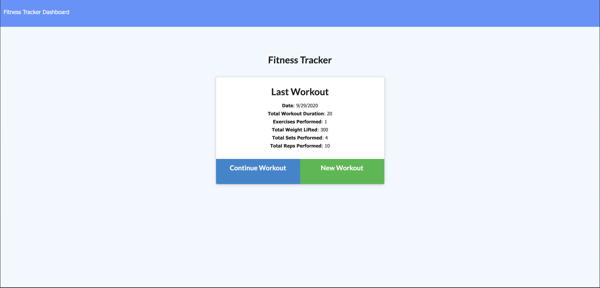

# workOutTracker

# Description

The workOutTracker application allows users to create, view and track workouts. The user can log multiple exercises and track by type, name, weight, sets, duration and reps.

# Links
[Heroku](https://radiant-forest-64716.herokuapp.com/?id=5f763da722df9800187262cd)

[GitHub](https://github.com/TyshiaGray/workOutTracker)

# workOutTracker Preview

